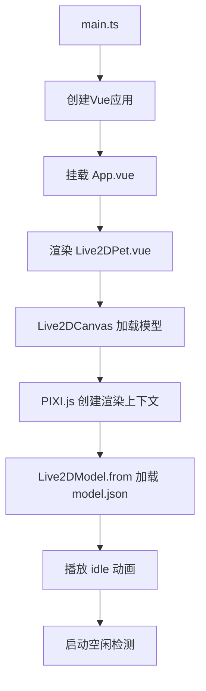
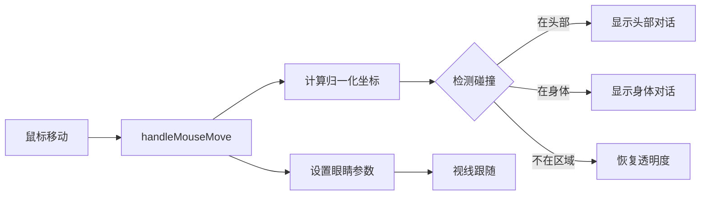

# 📚 桌面 Live2D 宠物项目 - 完整技术文档

## 🎯 项目概述

这是一个基于 **Tauri + Vue 3 + TypeScript** 的桌面 Live2D 宠物应用，使用 **pixi-live2d-display** 库渲染 Live2D 模型。

### 核心特性
- ✨ **透明窗口**：无边框透明桌面窗口，始终置顶
- 👁️ **视线跟随**：角色眼睛跟随鼠标移动
- 🖱️ **点击互动**：点击头部/身体触发不同动作和语音
- 💬 **对话系统**：随机显示可爱对话气泡
- 😴 **睡眠模式**：长时间无操作自动进入睡眠状态
- 🎮 **控制面板**：睡眠/唤醒、重置位置按钮

---

## 📁 项目文件结构

```
table-pet-game/
├── 📄 package.json                 # 项目依赖和脚本配置
├── 📄 tsconfig.json                # TypeScript 编译配置
├── 📄 vite.config.ts               # Vite 构建工具配置
├── 📄 index.html                   # HTML 入口文件
│
├── 📂 public/                      # 静态资源目录（直接复制到输出目录）
│   ├── libs/                       # Live2D 核心库
│   │   ├── live2d.min.js          # Live2D 基础库
│   │   ├── live2dcubismcore.js    # Cubism Core SDK
│   │   └── live2dcubismcore.min.js
│   └── models/                     # Live2D 模型文件
│       ├── histoire/              # Histoire 角色模型
│       │   ├── model.json         # 模型配置文件（关键！）
│       │   ├── model.moc          # 模型数据文件
│       │   ├── ico_histoire.png   # 角色图标
│       │   ├── motions/           # 动作文件目录
│       │   │   ├── idle/         # 待机动作
│       │   │   └── tap/          # 点击动作
│       │   └── histoire.1024/    # 贴图纹理目录
│       └── nep/                   # Nep 角色模型（备用）
│
├── 📂 src/                         # 源代码目录
│   ├── main.ts                    # Vue应用入口
│   ├── App.vue                    # 根组件
│   │
│   ├── 📂 components/             # Vue 组件目录
│   │   ├── Live2DPet.vue         # 【核心】Live2D 宠物主组件
│   │   └── Live2DPetComponents/  # 子组件目录
│   │       ├── Live2DCanvas.vue  # Live2D 画布渲染组件
│   │       ├── Live2DMessage.vue # 消息气泡组件
│   │       └── ControlPanel.vue  # 控制面板组件
│   │
│   └── 📂 composables/            # 【重要】可组合函数目录
│       ├── useIdleDetection.ts   # 空闲/睡眠检测逻辑
│       ├── useMessageSystem.ts   # 消息系统管理
│       └── useHitDetection.ts    # 碰撞检测工具
│
└── 📂 src-tauri/                   # Tauri 后端目录（Rust）
    ├── Cargo.toml                 # Rust 依赖配置
    ├── tauri.conf.json            # Tauri 应用配置
    ├── src/
    │   ├── main.rs                # Rust 主入口
    │   └── lib.rs                 # Rust 库文件
    └── icons/                     # 应用图标资源
```

---

## 🔧 核心技术栈详解

### 1. **前端框架**
- **Vue 3.5.13**：使用 Composition API + `<script setup>` 语法
- **TypeScript 5.6.2**：类型安全的 JavaScript 超集
- **Vite 6.0.3**：下一代前端构建工具

### 2. **图形渲染**
- **PIXI.js 6.5.10**：高性能 2D 图形渲染库
- **pixi-live2d-display 0.4.0**：基于 PIXI 的 Live2D 渲染器
  - 专门使用 `cubism2` 模块（Cubism 2 SDK）
  - 支持 `.moc` 和 `.model.json` 格式的旧版 Live2D 模型

### 3. **桌面应用框架**
- **Tauri 2.x**：轻量级桌面应用框架
  - 前端：Web 技术（Vue + TS）
  - 后端：Rust（系统级 API 调用）
  - 优势：体积极小（~5MB），内存占用低

---

## 📝 各文件详细功能说明

### 🔹 配置文件

#### `package.json` - 项目依赖管理
```json
{
  "dependencies": {
    "@tauri-apps/api": "^2",           // Tauri JS API
    "pixi-live2d-display": "^0.4.0",   // Live2D 渲染器
    "pixi.js": "^6.5.10",              // 图形引擎
    "vue": "^3.5.13"                   // Vue 框架
  },
  "scripts": {
    "dev": "vite",                     // 启动开发服务器
    "tauri": "tauri"                   // Tauri 打包命令
  }
}
```

#### `vite.config.ts` - Vite 构建配置
- **端口固定**：1420（Tauri 期望的端口）
- **依赖预构建**：强制预构建 pixi 相关库，解决 CommonJS 导出问题
- **热更新**：配置 WebSocket HMR

---

### 🔹 核心组件

#### `src/main.ts` - 应用入口
```typescript
// 创建Vue应用并挂载到 #app 元素
createApp(App).mount("#app");
```

#### `src/App.vue` - 根组件
- **透明容器**：设置完全透明背景
- **拖拽区域**：`data-tauri-drag-region` 允许拖动窗口
- **全屏显示**：100vw/100vh，隐藏滚动条

---

### 🔹 Live2DPet.vue - 主组件（核心中的核心）

**职责**：整合所有子组件和 composable，实现完整的交互逻辑

**核心功能模块**：

1. **模型加载**
   ```typescript
   const currentModel = ref(models[0]);  // 当前模型配置
   const handleModelLoaded = (loadedModel) => {
     model = loadedModel;  // 保存模型实例
   }
   ```

2. **视线跟随**（第 216-426 行）
   ```typescript
   const handleMouseMove = (e: MouseEvent) => {
     // 计算鼠标相对屏幕中心的偏移
     const eyeX = ((e.clientX - screenCenterX) / screenCenterX) * 0.8;
     const eyeY = -((e.clientY - screenCenterY) / screenCenterY) * 0.8;
     
     // 设置 Live2D 眼睛参数
     coreModel.setParameterValueById('ParamAngleX', eyeX);
     coreModel.setParameterValueById('ParamEyeBallX', eyeX * 0.8);
   }
   ```

3. **碰撞检测**
   ```typescript
   const headHit = isInHitArea(x, y, currentModel.value.hitAreas.head);
   const bodyHit = isInHitArea(x, y, currentModel.value.hitAreas.body);
   ```

4. **透明度控制**
   ```typescript
   const containerStyle = computed(() => ({
     opacity: isMouseOver.value ? 0.1 : 1  // 悬停时变透明
   }));
   ```

5. **事件监听**
   - `mousemove`：全局鼠标移动
   - `click`：全局点击事件

---

### 🔹 Live2DCanvas.vue - 画布组件

**职责**：负责 Live2D 模型的加载和渲染

**关键技术点**：

1. **PIXI.js 应用创建**
   ```typescript
   app = new PIXI.Application({
     view: canvas.value,
     backgroundAlpha: 0,  // 透明背景
     width: 358,
     height: 374
   });
   ```

2. **模型加载**
   ```typescript
   model = await Live2DModel.from('/models/histoire/model.json');
   app.stage.addChild(model);
   ```

3. **模型缩放和定位**
   ```typescript
   const resizeModel = () => {
     const scale = (props.height / 1080) * 0.5;  // 动态缩放
     model.scale.set(scale);
     model.anchor.set(0.5, 1);  // 底部中心对齐
     model.x = props.width / 2;
     model.y = props.height;
   }
   ```

4. **动画播放**
   ```typescript
   const playMotion = (motionType: string) => {
     const motions = model.motions[motionType];
     const randomIndex = Math.floor(Math.random() * motions.length);
     model.motion(motions[randomIndex]);  // 播放随机动作
   }
   ```

---

### 🔹 Live2DMessage.vue - 消息组件

**功能**：显示对话气泡

**特性**：
- 响应式显示/隐藏
- 淡入淡出动画（CSS keyframes）
- 自定义位置（垂直/水平）

```vue
<template>
  <div v-if="show" class="message-box" :style="messageStyle">
    {{ text }}
  </div>
</template>
```

---

### 🔹 ControlPanel.vue - 控制面板

**功能**：提供用户交互按钮

**按钮**：
- 💤 睡眠/唤醒切换
- 🏠 重置位置

**设计**：
- 默认半透明（opacity: 0.3）
- 悬停时完全显示
- 圆形图标按钮

---

### 🔹 Composable 函数（可复用逻辑）

#### `useIdleDetection.ts` - 空闲检测

**工作原理**：双层定时器机制

```typescript
resetIdleTimer() {
  // 第一层：5 秒后触发空闲
  idleTimer = setTimeout(() => {
    onIdle();  // 显示无聊消息
    
    // 第二层：再等 30 秒触发睡眠
    sleepTimeout = setTimeout(() => {
      isSleeping.value = true;
      onSleep();  // 播放睡眠动画
    }, 30000);
  }, 5000);
}
```

**返回值**：
- `isSleeping`：睡眠状态（响应式）
- `startIdleDetection()`：启动检测
- `toggleSleep()`：切换睡眠

---

#### `useMessageSystem.ts` - 消息系统

**预设对话库**：
```typescript
const messages = {
  mouseover: {
    head: ['不要摸我的头啦~', '头发要被弄乱了!'],
    body: ['不要动手动脚的!', '哼!']
  },
  click: {
    head: ['哎呀!', '很痒的!'],
    body: ['呀!', '真是的...']
  },
  idle: ['好无聊啊~', '有人吗？'],
  sleepy: ['呼...呼...', '晚安...']
}
```

**方法**：
- `show(text, duration)`：显示指定消息
- `showRandom(msgs)`：随机显示消息
- `hide()`：立即隐藏

---

#### `useHitDetection.ts` - 碰撞检测

**核心方法**：

1. **坐标转换**
   ```typescript
   const getNormalizedCoords = (clientX, clientY, rect) => {
     const x = ((clientX - rect.left) / rect.width) * 2 - 1;
     const y = -((clientY - rect.top) / rect.height) * 2 + 1;
     return { x, y };  // 范围：-1 ~ 1
   }
   ```

2. **矩形检测**
   ```typescript
   const isInHitArea = (x, y, area) => {
     return x >= Math.min(...area.x) && x <= Math.max(...area.x) &&
            y >= Math.min(...area.y) && y <= Math.max(...area.y);
   }
   ```

---

## 🎨 Live2D 模型文件说明

### model.json 结构示例

```json
{
  "type": "Live2D Model Setting",
  "name": "histoire",
  "model": "model.moc",
  "textures": [
    "histoire.1024/texture_00.png",
    "histoire.1024/texture_01.png"
  ],
  "motions": {
    "idle": [
      {"file": "motions/idle/NOZOMU_M01.mtn"},
      {"file": "motions/idle/NOZOMU_M02.mtn"}
    ],
    "tap_body": [
      {"file": "motions/tap/DK_NOZOMU_0011.mtn"}
    ]
  },
  "hit_areas": {
    "head": "Head",
    "body": "Body"
  }
}
```

**关键字段**：
- `model`：指向 `.moc` 模型数据文件
- `textures`：贴图数组（按顺序加载）
- `motions`：动作字典（key=动作类型，value=动作文件数组）
- `hit_areas`：命中区域名称映射

---

## 🚀 开发和运行流程

### 1. 开发环境启动
```bash
npm run dev        # 启动 Vite 开发服务器（端口 1420）
npm run tauri dev  # 启动 Tauri 桌面应用
```

### 2. 应用启动流程



### 3. 交互流程



---

## 🎯 关键技术点总结

### 1. **Live2D 坐标系**
- X 轴：-1（左）~ 1（右）
- Y 轴：-1（下）~ 1（上）
- 原点：画布中心

### 2. **眼睛参数**
- `ParamAngleX/Y`：头部转动角度
- `ParamEyeBallX/Y`：眼球移动
- `ParamEyeOpenX/Y`：眼睛开合

### 3. **透明度技巧**
```css
/* 鼠标悬停时降低透明度，实现"穿透"效果 */
opacity: isMouseOver.value ? 0.1 : 1;
transition: opacity 0.2s ease;
```

### 4. **Tauri 窗口设置**
```typescript
const tauriWindow = getCurrentWindow();
await tauriWindow.setAlwaysOnTop(true);  // 始终置顶
await tauriWindow.setSize({ width: 358, height: 374 });  // 固定大小
```

---

## 🛠️ 常见问题和优化方向

### 性能优化
- ✅ 使用 `autoUpdate=true` 启用自动渲染循环
- ✅ 透明背景减少重绘区域
- ✅ 定时器清理防止内存泄漏

### 兼容性处理
- ✅ 多层 API 尝试（setParameterValueById → setParamFloat → 其他）
- ✅ 备选动画列表（idle → rest → talk → ...）
- ✅ 错误捕获和降级处理

### 扩展方向
- 🔧 添加更多角色模型
- 🔧 自定义对话内容
- 🔧 增加更多互动动作
- 🔧 主题切换功能
- 🔧 语音播放功能

---

## 📖 学习资源

- [Vue 3 官方文档](https://vuejs.org/)
- [Tauri 官方文档](https://tauri.app/)
- [pixi-live2d-display GitHub](https://github.com/guansss/pixi-live2d-display)
- [Live2D Cubism2 规格文档](https://docs.live2d.com/en/cubism-editor-manual/specifications/)

---

**最后更新时间**：2026-03-23  
**项目版本**：0.1.0
